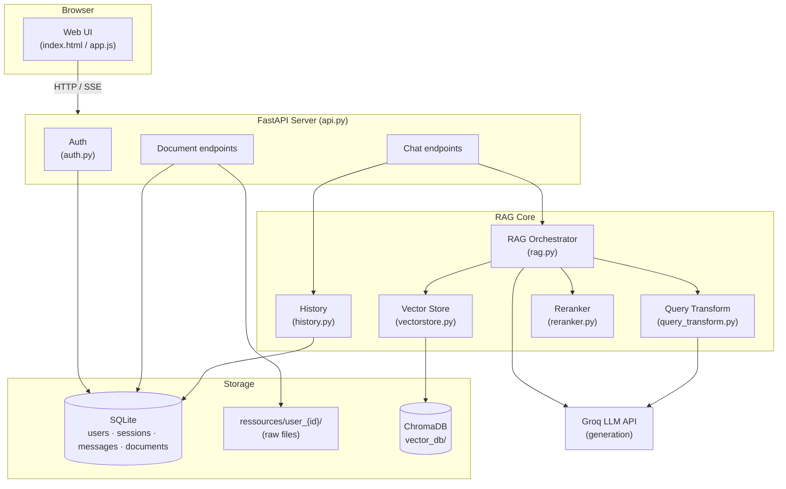

# Atlas — Multi-Tenant RAG Chatbot SaaS

> A production-oriented **Retrieval-Augmented Generation (RAG)** chatbot that turns your company documents into a private, per-user knowledge assistant.

Atlas is a full-stack AI SaaS: users sign up, upload their own documents (PDF / Markdown / TXT), and chat with an assistant that answers **only** from those documents — with citations, streaming responses, conversation history, and strict per-user data isolation.

---

## Table of Contents

- [What is this project?](#what-is-this-project)
- [Why RAG?](#why-rag)
- [Key Features](#key-features)
- [Architecture](#architecture)
- [The RAG Pipeline](#the-rag-pipeline)
- [Retrieval Optimizations](#retrieval-optimizations)
- [Multi-Tenant Isolation](#multi-tenant-isolation)
- [Evaluation Framework](#evaluation-framework)
- [Tech Stack](#tech-stack)
- [Project Structure](#project-structure)
- [Getting Started](#getting-started)
- [Configuration](#configuration)
- [API Reference](#api-reference)
- [Running the Evaluations](#running-the-evaluations)
- [Design Decisions](#design-decisions)
- [Roadmap](#roadmap)

---

## What is this project?

Atlas is a **SaaS-style AI assistant** built around a RAG core. Instead of fine-tuning a model on your data (expensive, slow, hard to update), Atlas retrieves the relevant passages from your documents **at question time** and feeds them to a Large Language Model.

The result:

- Answers grounded in **your** documents, not the model's training data
- **Up-to-date** knowledge — just re-upload a document
- **Traceable** answers — every response cites its source
- **Private** — each user only ever sees their own documents

The project is designed as a real product, not a demo: it includes authentication, a web UI, streaming responses, conversation history, document management, and an objective evaluation suite.

---

## Why RAG?

A plain LLM has three problems for business use:

| Problem | RAG's answer |
|---|---|
| It doesn't know your private data | Retrieve it from your documents at query time |
| Its knowledge is frozen at training time | Update the vector store, no retraining |
| It hallucinates confidently | Constrain it to the retrieved context + force citations |

**RAG = Retrieval-Augmented Generation.** The model is not retrained. Instead, the relevant context is *augmented* into the prompt:

```
Question ──▶ Retrieve relevant chunks ──▶ Inject into prompt ──▶ LLM generates grounded answer
```

---

## Key Features

- 🔐 **Authentication** — email + bcrypt-hashed passwords, revocable session tokens
- 👤 **Anonymous mode** — try the chatbot without an account (nothing persisted)
- 📄 **Document upload** — PDF, Markdown, and TXT, with automatic chunking and indexing
- 🔎 **Semantic search** — local embeddings, no per-token embedding cost
- 🧠 **Advanced retrieval** — Multi-Query, HyDE, and cross-encoder reranking
- ⚡ **Streaming responses** — Server-Sent Events (SSE) for token-by-token output
- 💬 **Conversation history** — multi-session chat with follow-up question reformulation
- 🏢 **Multi-tenant isolation** — per-user folders, metadata, and vector filters
- 📊 **Evaluation suite** — retrieval metrics, LLM-as-a-judge generation metrics, and config comparison
- 🎨 **Web UI** — a clean chat interface served directly by the API

---

## Architecture



---

## The RAG Pipeline

### 1. Ingestion (offline, on upload)

```
File ──▶ Load text ──▶ Split into chunks ──▶ Embed ──▶ Store in ChromaDB
```

- **Loading** — `pypdf` for PDFs, plain read for `.md` / `.txt`
- **Chunking** — `RecursiveCharacterTextSplitter` with `CHUNK_SIZE=800` and `CHUNK_OVERLAP=150`
  - The overlap prevents an idea from being cut in half between two chunks
- **Embedding** — local `sentence-transformers/all-MiniLM-L6-v2` (~90 MB, free, no API calls)
- **Storage** — persistent ChromaDB collection, tagged with `user_id` metadata

### 2. Query (online, per question)

```
Question ──▶ Reformulate (history) ──▶ Query transform ──▶ Retrieve ──▶ Rerank ──▶ Generate ──▶ Stream
```

1. **Reformulation** — follow-up questions ("and for the DOM-TOM?") are rewritten into standalone questions using the conversation history
2. **Query transformation** — Multi-Query + HyDE expand the search
3. **Retrieval** — vector search returns ~20 candidates
4. **Reranking** — a cross-encoder scores each (question, chunk) pair and keeps the top-K
5. **Generation** — the LLM answers strictly from the retrieved context
6. **Streaming** — the answer is streamed back token by token via SSE

### The anti-hallucination prompt

The system prompt is the single most important guardrail:

```
You are an assistant that answers customer questions based ONLY on the
provided context.

Strict rules:
1. Answer only from the context below.
2. If the information is not in the context, reply exactly:
   "I do not have this information in the provided documents."
3. Never invent information.
4. Answer clearly, concisely, and professionally.
5. If possible, cite the source document used.
```

---

## Retrieval Optimizations

Each technique can be toggled independently so its impact can be **measured**, not assumed.

| Technique | What it does | Improves | Cost |
|---|---|---|---|
| **Multi-Query** | LLM rewrites the question N ways; search with all variants | Recall (vocabulary diversity) | 1 LLM call |
| **HyDE** | LLM writes a hypothetical answer; search with *that* | Recall (question → document form) | 1 LLM call |
| **Reranking** | Cross-encoder scores (question, chunk) pairs together | Precision (filters noise) | Local CPU only |

> ⚠️ **Why reranking matters:** Multi-Query and HyDE improve recall but introduce noise. The cross-encoder is the guardrail that cleans the candidate set before it reaches the LLM.

**Two-stage retrieval** is the classic production pattern:

```
Vector search (fast, approximate)  ──▶  ~20 candidates
Cross-encoder (slow, precise)      ──▶  top 4 final chunks
```

---

## Multi-Tenant Isolation

Data isolation is enforced at **three layers**:

| Layer | Mechanism |
|---|---|
| **Filesystem** | Each user has their own folder: `ressources/user_{id}/` |
| **Database** | The `documents` table records who uploaded what, when, and its size |
| **Vector store** | Every chunk carries a `user_id` metadata field; retrieval filters on it |

Even though the Chroma collection is physically shared, a user can **never** receive excerpts from another user's documents — the retrieval query is always scoped by `user_id`.

---

## Evaluation Framework

Atlas ships with an objective evaluation suite — because "it feels better" is not a metric.

### `eval_retrieval.py` — retrieval quality

| Metric | Question it answers |
|---|---|
| **Hit Rate @k** | Is the correct document somewhere in the top-k? |
| **Recall @k** | What fraction of expected documents were found? |
| **MRR** | At what rank does the first correct result appear? |
| **Precision @k** | How much noise is in the retrieved chunks? |

### `eval_generation.py` — answer quality (LLM-as-a-judge)

| Metric | Question it answers |
|---|---|
| **Faithfulness** 🔴 | Is every claim supported by the context? (hallucination detector) |
| **Relevancy** | Does the answer actually address the question? |
| **Correct refusal** | On unanswerable questions, does it refuse instead of inventing? |

> The judge model is **different** from the generation model to avoid self-preference bias.

### `eval_compare.py` — configuration comparison

Runs all **2³ = 8 combinations** of Multi-Query / HyDE / Rerank and produces a comparison table with retrieval metrics, generation metrics, and latency — so you can decide objectively which optimizations are worth their cost.

---

## Tech Stack

| Layer | Technology |
|---|---|
| **API** | FastAPI + Uvicorn |
| **Orchestration** | LangChain |
| **LLM** | Groq (`openai/gpt-oss-120b` for generation, `openai/gpt-oss-20b` for auxiliary tasks) |
| **Embeddings** | `sentence-transformers/all-MiniLM-L6-v2` (local) |
| **Reranker** | `cross-encoder/ms-marco-MiniLM-L-6-v2` (local) |
| **Vector store** | ChromaDB (persistent) |
| **Database** | SQLite + SQLAlchemy |
| **Auth** | bcrypt + revocable DB-backed tokens |
| **Frontend** | Vanilla HTML / CSS / JS |

---

## Project Structure

```
AI Agent/
├── rag_core/
│   ├── api.py                 # FastAPI app — HTTP endpoints + serves the UI
│   ├── auth.py                # Signup, login, token verification
│   ├── chat.py                # CLI chat interface
│   ├── config.py              # Central configuration (env-overridable)
│   ├── database.py            # SQLAlchemy engine + session
│   ├── documents.py           # Per-user document management
│   ├── history.py             # Conversation history + follow-up reformulation
│   ├── ingestion.py           # File loading + chunking
│   ├── models.py              # ORM models (User, AuthToken, ChatSession, ...)
│   ├── query_transform.py     # Multi-Query + HyDE
│   ├── rag.py                 # RAG orchestrator (retrieve → augment → generate)
│   ├── reranker.py            # Cross-encoder reranking
│   ├── vectorstore.py         # Embeddings + ChromaDB
│   ├── eval_dataset.py        # Test questions + expected sources
│   ├── eval_retrieval.py      # Retrieval metrics
│   ├── eval_generation.py     # Generation metrics (LLM-as-a-judge)
│   ├── eval_compare.py        # Compare all optimization combinations
│   ├── requirements.txt
│   ├── ressources/            # Uploaded documents, per user
│   │   └── user_{id}/
│   ├── vector_db/             # ChromaDB persistence (git-ignored)
│   └── web/                   # Chat UI (index.html, app.js, style.css)
└── README.md
```

---

## Getting Started

### Prerequisites

- **Python 3.11+**
- A **Groq API key** — get one free at [console.groq.com](https://console.groq.com)

### 1. Clone and create a virtual environment

```bash
git clone https://github.com/marouane-quaisse/RAG-chatbot.git
cd RAG-chatbot

python -m venv .venv
# Windows
.venv\Scripts\activate
# macOS / Linux
source .venv/bin/activate
```

### 2. Install dependencies

```bash
pip install -r rag_core/requirements.txt
```

### 3. Configure environment variables

Create a `.env` file at the project root:

```env
GROQ_API_KEY=your_groq_api_key_here
```

### 4. Run the server

```bash
python -m uvicorn api:app --port 8000 --app-dir rag_core
```

Then open **http://localhost:8000** in your browser.

> On first run, the embedding model (~90 MB) is downloaded automatically.

---

## Configuration

All parameters live in `config.py` and can be overridden via `.env`:

| Variable | Default | Description |
|---|---|---|
| `GROQ_API_KEY` | — | **Required.** Your Groq API key |
| `GROQ_MODEL` | `openai/gpt-oss-120b` | Main generation model |
| `AUX_MODEL` | `openai/gpt-oss-20b` | Fast model for Multi-Query / HyDE |
| `EMBEDDING_MODEL` | `sentence-transformers/all-MiniLM-L6-v2` | Local embedding model |
| `RERANKER_MODEL` | `cross-encoder/ms-marco-MiniLM-L-6-v2` | Local reranker |
| `CHUNK_SIZE` | `800` | Chunk size in characters |
| `CHUNK_OVERLAP` | `150` | Overlap between adjacent chunks |
| `TOP_K` | `4` | Final chunks sent to the LLM |
| `RETRIEVAL_CANDIDATES` | `20` | Candidates retrieved before reranking |
| `MULTI_QUERY_COUNT` | `3` | Number of query reformulations |
| `ENABLE_MULTI_QUERY` | `true` | Toggle Multi-Query |
| `ENABLE_HYDE` | `true` | Toggle HyDE |
| `ENABLE_RERANK` | `true` | Toggle reranking |
| `COLLECTION_NAME` | `business_docs` | Chroma collection name |

---

## API Reference

| Method | Endpoint | Description |
|---|---|---|
| `GET` | `/` | Chat web interface |
| `GET` | `/api/status` | Vector store state + active configuration |
| `POST` | `/api/chat` | Ask a question → full JSON answer |
| `POST` | `/api/chat/stream` | Ask a question → streamed answer (SSE) |
| `POST` | `/api/upload` | Upload a document to your space |
| `GET` | `/api/documents` | List your documents |
| `GET` | `/api/documents/{name}/download` | Download one of your documents |
| `DELETE` | `/api/documents/{name}` | Delete a document (re-indexes) |
| `POST` | `/api/reindex` | Re-index your documents |

Interactive API docs are available at **http://localhost:8000/docs** (Swagger UI).

---

## Running the Evaluations

```bash
cd rag_core

# Retrieval metrics only (fast, free — no LLM calls)
python eval_retrieval.py

# Generation metrics (LLM-as-a-judge)
python eval_generation.py

# Compare all 8 optimization combinations
python eval_compare.py                  # full run (~10-20 min)
python eval_compare.py --quick          # 8 cases only
python eval_compare.py --retrieval-only # no generation LLM calls
```

To compare configurations, edit the `ENABLE_*` flags in `.env` and re-run.

---

## Design Decisions

A few choices worth explaining:

- **Local embeddings & reranker** — zero per-token cost, no data leaves the machine for indexing, and no API rate limits on the retrieval path.
- **Revocable tokens instead of JWT** — a JWT can't be invalidated before expiry. DB-backed tokens allow instant logout and banning.
- **Metadata in DB, bytes on disk** — keeps the database light and fast to back up, enables streaming downloads, and records *who uploaded what and when*.
- **Streaming (SSE)** — an LLM takes 1–3 s to write a full answer. Streaming makes perceived latency drop dramatically (the ChatGPT effect).
- **`temperature=0` for generation** — business answers must be factual and reproducible, not creative.
- **Cached models** — the embedding model and Chroma client are loaded once per process, not per request (~8× faster retrieval).

---

## Roadmap

- [ ] Support for `.docx` and `.csv` ingestion
- [ ] OCR for scanned PDFs (Tesseract)
- [ ] Per-tenant Chroma collections for stronger isolation
- [ ] Parallel Multi-Query / HyDE calls to cut latency
- [ ] Docker Compose deployment
- [ ] Usage analytics dashboard (latency, sources, cost per session)

---

## License

This project is provided for educational and portfolio purposes.
