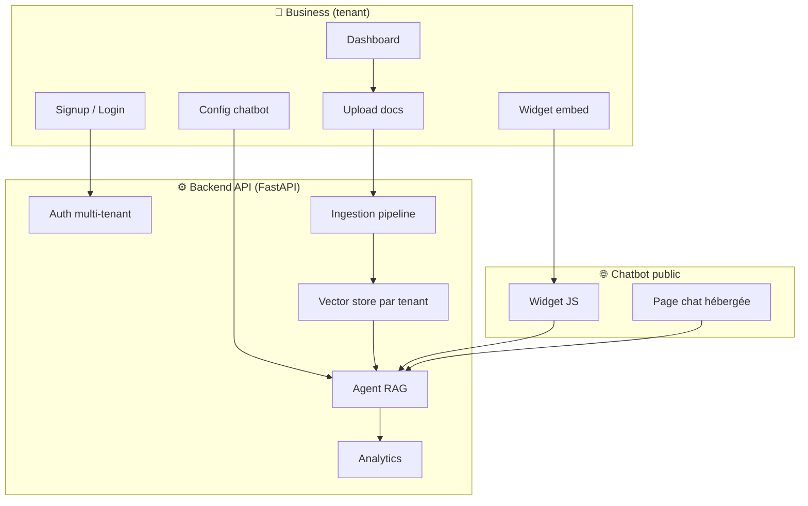
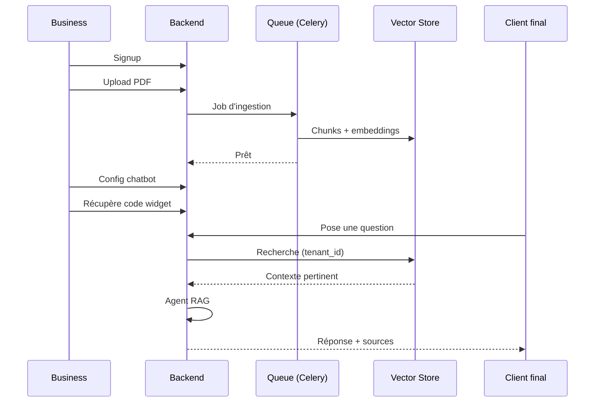

# Plan — Plateforme SaaS de Chatbots RAG multi-tenant

> **Vision** : Un business s'inscrit, upload ses documents (PDF, DOCX, images, web), et obtient instantanément un chatbot personnalisé qui répond aux questions de ses clients en se basant **uniquement** sur son contenu.

---

## 1. Objectifs

### Objectif principal
Créer une plateforme SaaS où chaque business (tenant) peut :
- Uploader son contenu métier (PDF, DOCX, images, CSV, URLs)
- Configurer un chatbot personnalisé (nom, couleur, prompt, langue)
- Obtenir un widget embarquable en 1 ligne de JS
- Suivre les analytics (questions fréquentes, taux de résolution)

### Objectifs secondaires
- Isolation stricte des données entre tenants
- Anti-hallucination : le bot répond uniquement depuis le contenu du tenant
- Streaming des réponses pour une UX fluide
- Modèle économique freemium

---

## 2. Architecture



### Flux d'ingestion



---

## 3. Stack technique

| Couche | Techno | Justification |
|---|---|---|
| **Backend** | FastAPI | Async, typé, rapide |
| **Frontend** | Next.js + Tailwind | Moderne, SSR, déployable |
| **DB relationnelle** | PostgreSQL | Tenants, users, documents, analytics |
| **Vector store** | Qdrant | Multi-tenant natif, scalable |
| **LLM** | Groq (`gpt-oss-120b`) | Rapide, économique |
| **Embeddings** | `sentence-transformers` | Local, gratuit |
| **Queue** | Celery + Redis | Ingestion asynchrone |
| **Storage** | MinIO (S3-compatible) | Fichiers uploadés |
| **Auth** | JWT + bcrypt | Standard |
| **Conteneurisation** | Docker Compose | Dev + déploiement |

---

## 4. Structure du projet

```
rag-saas/
├── backend/
│   ├── app/
│   │   ├── main.py              # FastAPI app + CORS + routers
│   │   ├── config.py            # Settings (pydantic-settings)
│   │   ├── database.py          # SQLAlchemy engine + session
│   │   ├── models/              # Tenant, User, Document, ChatSession, Message
│   │   ├── schemas/             # Pydantic DTOs
│   │   ├── api/
│   │   │   ├── auth.py          # Signup / login / refresh
│   │   │   ├── tenants.py       # CRUD business
│   │   │   ├── documents.py     # Upload + statut ingestion
│   │   │   ├── chat.py          # Endpoint chatbot (streaming)
│   │   │   ├── widgets.py       # Config widget + code embed
│   │   │   └── analytics.py     # Stats
│   │   ├── rag/
│   │   │   ├── ingestion.py     # Parsing multi-format
│   │   │   ├── chunking.py      # Découpage intelligent
│   │   │   ├── embeddings.py    # Vectorisation
│   │   │   ├── vectorstore.py   # Qdrant multi-tenant
│   │   │   └── agent.py         # Agent RAG + garde-fous
│   │   ├── core/
│   │   │   ├── security.py      # JWT, hashing
│   │   │   └── deps.py          # Dépendances FastAPI
│   │   └── workers/
│   │       └── tasks.py         # Tâches Celery
│   ├── tests/
│   ├── requirements.txt
│   └── Dockerfile
├── frontend/
│   ├── app/
│   │   ├── (auth)/login/
│   │   ├── dashboard/
│   │   │   ├── documents/
│   │   │   ├── chatbot/
│   │   │   └── analytics/
│   │   └── chat/[botId]/        # Chat public
│   ├── components/
│   │   ├── ChatWidget.tsx       # Widget embarquable
│   │   └── FileUpload.tsx
│   └── package.json
├── docker-compose.yml           # Postgres + Redis + Qdrant + MinIO
├── .env.example
└── README.md
```

---

## 5. Modèle de données

| Table | Champs clés |
|---|---|
| `tenants` | id, name, slug, plan, created_at |
| `users` | id, tenant_id, email, hashed_password, role |
| `documents` | id, tenant_id, filename, type, status, size, s3_key |
| `chunks` | id, document_id, tenant_id, content, vector_id, page |
| `chatbots` | id, tenant_id, name, system_prompt, color, language |
| `chat_sessions` | id, chatbot_id, visitor_id, created_at |
| `messages` | id, session_id, role, content, sources, tokens, latency_ms |

---

## 6. Phases d'implémentation

### Phase 1 — Fondations (backend + infra)
1. Initialiser le projet (`backend/`, `docker-compose.yml`, `.env.example`)
2. Configurer PostgreSQL, Redis, Qdrant, MinIO via Docker Compose
3. Créer les modèles SQLAlchemy + migrations (Alembic)
4. Implémenter l'auth JWT (signup, login, refresh)
5. Middleware multi-tenant (extraction `tenant_id` du token)

### Phase 2 — Ingestion RAG
6. Pipeline de parsing multi-format (PDF, DOCX, TXT, CSV, images OCR)
7. Chunking intelligent (par taille + overlap, respect des sections)
8. Génération d'embeddings (`sentence-transformers`)
9. Stockage dans Qdrant avec collection/namespace par tenant
10. Tâches Celery pour ingestion asynchrone + statut

### Phase 3 — Agent RAG
11. Retriever filtré par `tenant_id`
12. Agent RAG avec garde-fous (répond uniquement depuis le contexte)
13. Prompt système anti-hallucination + "je ne sais pas"
14. Citation des sources (document + page)
15. Endpoint chat avec streaming (SSE)

### Phase 4 — Frontend business
16. Pages auth (login/signup)
17. Dashboard : upload de documents + statut
18. Config chatbot (nom, couleur, prompt, langue)
19. Page analytics (questions fréquentes, taux de résolution)

### Phase 5 — Chatbot public
20. Page chat hébergée (`/chat/[botId]`)
21. Widget JS embarquable (1 ligne)
22. Personnalisation visuelle (couleur, avatar, message d'accueil)

### Phase 6 — Production
23. Rate limiting par plan
24. Cache des réponses fréquentes
25. Logs + monitoring (latence, coût, erreurs)
26. Tests (unitaires + intégration)
27. Déploiement (Docker + reverse proxy)

---

## 7. Fonctionnalités différenciantes

| Fonctionnalité | Impact business |
|---|---|
| **Widget embarquable** (1 ligne JS) | Adoption facile |
| **"Je ne sais pas" fiable** | Confiance |
| **Sources citées** | Vérifiabilité |
| **Analytics** (questions fréquentes) | Valeur business |
| **Escalade humaine** | Complétude |
| **Multi-langue** | Marché global |
| **Personnalisation visuelle** | Marque du client |

---

## 8. Modèle économique

| Plan | Prix | Limites |
|---|---|---|
| **Free** | 0€ | 1 chatbot, 50 docs, 100 msg/mois |
| **Starter** | 29€/mois | 3 chatbots, 500 docs, 5k msg/mois |
| **Pro** | 99€/mois | 10 chatbots, illimité, API, analytics |
| **Enterprise** | Sur devis | SSO, SLA, on-premise |

---

## 9. Points de vigilance

1. **Coût LLM** : limite par plan, cache les réponses fréquentes
2. **Qualité d'ingestion** : les PDF scannés nécessitent OCR
3. **Sécurité** : ne JAMAIS laisser un tenant accéder aux données d'un autre
4. **RGPD** : consentement, droit à l'effacement, hébergement UE
5. **Latence** : streaming obligatoire pour l'UX
6. **Qualité RAG** : évaluer la précision (jeu de test Q/R)

---

## 10. Critères de succès (MVP)

- [ ] Un business peut s'inscrire et uploader un PDF
- [ ] Le PDF est ingéré et indexé en < 30s
- [ ] Le chatbot répond correctement à 80% des questions du contenu
- [ ] Le bot dit "je ne sais pas" pour les questions hors contenu
- [ ] Les sources sont citées
- [ ] Le widget s'embarque sur un site externe
- [ ] Les données de 2 tenants sont strictement isolées
- [ ] Les réponses sont streamées

---

## 11. Prochaines étapes

1. **Valider** : vector store (Qdrant vs Chroma) et frontend (Next.js vs Streamlit MVP)
2. **Démarrer Phase 1** : structure + Docker Compose + auth
3. **Itérer** phase par phase avec tests à chaque étape